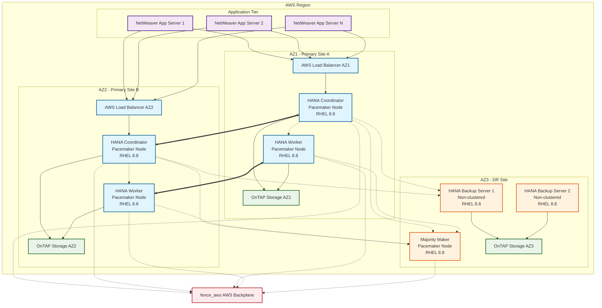

# S4HANA Scale-Out Architecture on AWS EC2

## Overview

This project documents and implements a highly available SAP S4HANA scale-out architecture deployed across three AWS Availability Zones using Pacemaker clustering for automated failover and high availability management.

## Architecture Description

The architecture implements a sophisticated multi-tier approach combining high availability (HA) and disaster recovery (DR) capabilities:

### High Availability Design (AZ1 & AZ2)
- **Two primary sites** across separate AWS Availability Zones
- Each site contains **two HANA servers** configured as Pacemaker cluster nodes
- **Scale-out configuration**: One coordinator node and one worker node per site
- **Active-passive site design**: Only one site is active at any given time
- **Synchronous database replication** between the two primary sites for zero data loss

### Disaster Recovery Design (AZ3)
- **Third site** in separate AWS Availability Zone for DR purposes
- Contains **majority maker Pacemaker node** for cluster quorum
- Hosts **two additional HANA servers** (non-clustered) for backup purposes
- Receives **asynchronous replication** from whichever primary site is currently active

### Clustering & Fencing
- **Pacemaker clustering** manages automatic failover between sites
- **AWS backplane fencing** using `fence_aws` (no SBD fencing)
- **ANGI SPA resource agent** for HANA resource management
- Majority maker node in AZ3 ensures proper quorum for split-brain prevention

### Network & Connectivity
- **NetWeaver application servers** connect to database tier
- **AWS Load Balancer** fronts coordinator nodes for connection routing
- Dynamic IP resolution: Applications query load balancer to determine active coordinator, then establish direct connections to appropriate database servers

### Infrastructure Specifications
- **Operating System**: RHEL 8.8 across all servers
- **Compute**: EC2 Superdome instances
- **Storage**: NetApp OnTAP on AWS for enterprise-grade storage
- **Network**: Multi-AZ deployment across three AWS Availability Zones

## Architecture Diagram

## Key Features

- **Zero-downtime failover** between primary sites using Pacemaker
- **Synchronous replication** for high availability (AZ1 ↔ AZ2)
- **Asynchronous replication** for disaster recovery (AZ1/AZ2 → AZ3)
- **Scale-out HANA architecture** with coordinator and worker nodes
- **AWS-native fencing** using fence_aws for reliable cluster operations
- **Enterprise storage** with NetApp OnTAP on AWS
- **Dynamic connection routing** via AWS Load Balancers

## Technology Stack

- **Database**: SAP HANA (Scale-out configuration)
- **Clustering**: Pacemaker with ANGI SPA resource agent
- **Fencing**: fence_aws (AWS backplane fencing)
- **Operating System**: Red Hat Enterprise Linux 8.8
- **Compute**: AWS EC2 Superdome instances
- **Storage**: NetApp OnTAP on AWS
- **Load Balancing**: AWS Application Load Balancer
- **Replication**: HANA System Replication (HSR)

## Implementation Notes

- Sites are designed for active-passive operation (only one site active at a time)
- Majority maker in AZ3 prevents split-brain scenarios
- NetWeaver applications use load balancer for initial coordinator discovery
- Direct database connections established after coordinator IP resolution
- Backup servers in AZ3 provide additional recovery options

## Contributing

1. Fork the repository
2. Create your feature branch (`git checkout -b feature/AmazingFeature`)
3. Commit your changes (`git commit -m 'Add some AmazingFeature'`)
4. Push to the branch (`git push origin feature/AmazingFeature`)
5. Open a Pull Request

## License

This project is licensed under the [MIT License](LICENSE) - see the LICENSE file for details.
